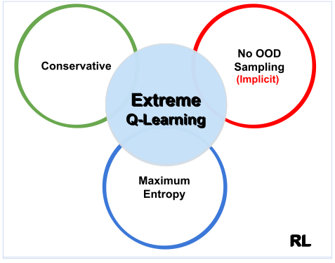

# Extreme Q-Learning (X-QL)

### [**[Project Page](https://div99.github.io/XQL)**] 

Official code base for **[Extreme Q-Learning: MaxEnt RL without Entropy](https://arxiv.org/abs/2301.02328)** by [Div Garg](https://divyanshgarg.com/)\*, [Joey Hejna](https://jhejna.github.io)\*, [Mattheiu Geist](https://scholar.google.com/citations?user=ectPLEUAAAAJ&hl=en), and [Stefano Ermon](https://cs.stanford.edu/~ermon/).
(*Equal Contribution)

**X-QL** is an novel & simple algorithm for Q-learning that models the maximal soft-values without needing to sample from a policy. It directly estimates the optimal Bellman operator B* in continuous action spaces, successfully extending Q-iteration to continuous settings.

It obtains state-of-art results on Offline RL benchmarks such as D4RL, and can improve existing Online RL methods like SAC and TD3. It combines Max Entropy, Conservative & Implicit RL in a single framework.
# Introduction

<a href="https://div99.github.io/XQL">
<p align="center">
	<br>
</p>
</a>

Modern Deep Reinforcement Learning (RL) algorithms require estimates of the maximal Q-value, which are difficult to compute in continuous domains with an infinite number of possible actions. In this work, we introduce a new update rule for online and offline RL which directly models the maximal value using Extreme Value Theory (EVT), drawing inspiration from Economics. By doing so, we avoid computing Q-values using out-of-distribution actions which is often a substantial source of error. Our key insight is to introduce an objective that directly estimates the optimal soft-value functions (LogSumExp) in the maximum entropy RL setting without needing to sample from a policy. <br><br>
Using EVT, we derive our **Extreme Q-Learning (XQL)** framework and consequently online and, for the first time, offline MaxEnt Q-learning algorithms,  ***that do not explicitly require access to a policy or its entropy.*** Our method obtains consistently strong performance in the D4RL benchmark, outperforming prior works by **10+ points** on some tasks while offering moderate improvements over SAC and TD3 on online DM Control tasks.


### Citation
```
@article{
	garg2022extreme,
	title={Extreme Q-Learning: MaxEnt Reinforcement Learning Without Entropy},
	url = {https://arxiv.org/abs/2301.02328},
  	author = {Garg, Divyansh and Hejna, Joey and Geist, Matthieu and Ermon, Stefano},
	publisher = {arXiv},
  	year = {2023},
	}
```

## Key Advantages

✅  Directly models V* in continuous action spaces \(Continuous Q-iteration\)   \
✅  Implict, no OOD Sampling or actor-critic formulation \
✅  Conservative with respect to the behavior policy \
✅  Improves performance on the D4RL benchmark versus similar approaches

## Usage

This repository is divided into two subparts, one for the offline and one for the online experiments.

To install and use X-QL check the instructions provided in the [Offline](offline) folder for running Offline RL and [Online](online) folder for running Online RL.


## Questions
Please feel free to email us if you have any questions. 

Div Garg ([divgarg@stanford.edu](mailto:divgarg@stanford.edu?subject=[GitHub]%X-QL)), Joey Hejna([jhejna@stanford.edu](mailto:jhejna@stanford.edu?subject=[GitHub]%X-QL))

